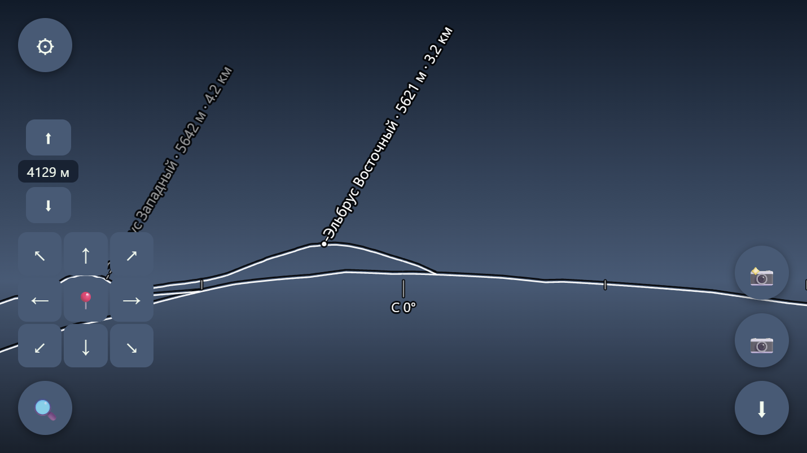

# Вершины

**Панорама горизонта с подписями вершин — прямо в браузере.** Открытый аналог
PeakFinder: показывает, какие горы видны из точки, где вы стоите, и как они
называются.

### 🏔 [Открыть демо](https://agran.github.io/vershiny/) · 📲 [Установить на телефон](https://agran.github.io/vershiny/install.html)

Работает без установки и без регистрации. Разрешите геолокацию — или откройте
готовую точку: [Приют 11 на Эльбрусе](https://agran.github.io/vershiny/?lat=43.318&lon=42.458),
[Церматт](https://agran.github.io/vershiny/?lat=46.02&lon=7.75).

На телефоне приложение сразу просит камеру: подписи ложатся поверх живого
кадра — это основной режим. На десктопе камеры нет, поэтому там тот же силуэт
рисуется на тёмном фоне.

Приложение ставится на домашний экран как обычное (PWA): работает офлайн,
обновляется само — когда выходит новая версия, внизу появляется плашка
«Доступно обновление».



*Тот же силуэт без камеры — вид с Приюта 11. У Восточной вершины кружок: она
видна; Западная стоит за склоном, поэтому её выноска обрывается о гребень и
маркера не имеет.*

## Что умеет

- **Камера** — основной режим: подписи ложатся поверх живого кадра, и вопрос
  «что это за гора» решается наведением телефона, а не сличением рисунка с
  тем, что перед глазами. На телефоне включается сама при запуске; выключили —
  запомнит и больше не будет спрашивать
- **Силуэт горизонта** — 3600 лучей по DEM с учётом кривизны Земли и рефракции,
  видимые гребни по корзинам дистанций, дальность до 200 км
- **Подписи вершин** — 692 тысячи вершин из OpenStreetMap, включая вулканы;
  двуязычные названия и транслитерация 12 письменностей
- **Отбор по значимости** — из тесной группы подписывается главная вершина,
  одиноко стоящая гора не проигрывает побочному пику соседнего массива
- **Скрытые вершины** — если горе не хватило до гребня меньше 400 м, она
  подписывается серым: «она вон за тем склоном»
- **Совмещение с кадром** — магнитное склонение добавляется само (WMM-2025 по
  GPS), остаток от железа в кармане подстраивается свайпом или автоматически
  по силуэту в кадре; поле зрения камеры подгоняется pinch-жестом
- **Поиск по всей планете** — с выбором из нескольких вариантов и указанием
  региона; «Казбек» находит `Kazbek`, «Эверест» — `Mount Everest`
- **Полёт** — перемещение по местности, подъём над землёй, перелёт к любой
  найденной вершине с автоматическим выбором точки обзора
- **Карта OSM** — где стоите и куда смотрите; перенос в любую точку планеты
  одним касанием, регион переключается сам
- **Снимок** — кадр с подписями сохраняется файлом, имя — по главной вершине;
  координаты и время попадают на картинку, только если включить их в настройках
- **Офлайн** — PWA: ставится на домашний экран, регион скачивается целиком и
  работает без сети; обновления приезжают сами

Аккаунтов нет, сервера нет, данные с телефона никуда не уходят. Единственный
сетевой запрос помимо рельефа — счётчик посещений (адрес страницы без
параметров, без карты кликов): нужно понимать, пользуются ли приложением. Без
сети он не загружается вовсе, а если его заблокировать — не изменится ничего.

## Данные

| Слой | Источник | Объём |
|---|---|---|
| Рельеф, онлайн | [AWS Terrain Tiles](https://registry.opendata.aws/terrain-tiles/) (Terrarium PNG) | весь мир, ~90 м |
| Рельеф, офлайн | Copernicus GLO-90 → [agran/vershiny-dem](https://github.com/agran/vershiny-dem) | 850 МБ, 217 м / 435 м / 1.7 км |
| Вершины | OpenStreetMap (`natural=peak`, `natural=volcano`) | 692 355, из них 4 984 вулкана |
| Регионы | `tools/regions.json` | 115 регионов, двуязычные |

175 ГБ исходных GeoTIFF сжимаются в разреженную пирамиду на 850 МБ: детальный
уровень достаётся горам приоритетных регионов, грубый покрывает всю сушу.
Подробности — в [DATA-PIPELINE.md](docs/DATA-PIPELINE.md).

## Как устроено

Vanilla TypeScript + Vite, **без фреймворков и без WebGL**: рендер — Canvas 2D
контурами, чтобы оверлей ложился на кадр камеры. Ray-marching вынесен в Web
Worker, данные лежат статикой на GitHub Pages — сервера нет вовсе.

```
src/core/     геометрия, DEM, горизонт, вершины, поиск, положение, i18n
src/ui/       рендер панорамы, карта, настройки, AR, фото
src/workers/  ray-marching горизонта
tools/        подготовка данных (Python)
docs/         архитектура, алгоритмы, пайплайн данных
test/         vitest — сценарии, а не отдельные функции
```

Алгоритмы и принятые решения — [ALGORITHMS.md](docs/ALGORITHMS.md),
архитектура — [ARCHITECTURE.md](docs/ARCHITECTURE.md),
текущее состояние — [STATUS.md](docs/STATUS.md).

## Запуск

```bash
npm install
npm run dev      # http://localhost:5173/vershiny/
npm test         # vitest
npx tsc          # проверка типов
npm run build    # прод-сборка в dist/
```

Рельеф приложение берёт из внешнего репозитория по сети, поэтому качать 175 ГБ
для разработки не нужно.

### Подготовка данных (Python 3.12)

```bash
pip install rasterio numpy tqdm

# GLO-90 → глобальная пирамида тайлов
python tools/glo90-to-tiles/glo90_to_tiles.py scan
python tools/glo90-to-tiles/glo90_to_tiles.py build --budget-mb 900

# planet.osm.pbf → вершины по регионам → индекс поиска
python tools/planet-peaks/planet_peaks.py planet.osm.pbf --regions-dir data/peaks-by-region
python tools/peaks-index/build_index.py
```

## Участие

Баги и идеи — в [issues](https://github.com/agran/vershiny/issues). Правки
данных о вершинах вносите **в OpenStreetMap**: приложение подтянет их при
следующей генерации.

Код-стайл и соглашения — [CONTRIBUTING.md](docs/CONTRIBUTING.md).

## Лицензии

Код — MIT. Данные:

- Рельеф: **© DLR/ESA — Copernicus DEM GLO-90**, свободно с указанием источника
- Вершины: **© участники OpenStreetMap**, [ODbL](https://opendatacommons.org/licenses/odbl/)
- Terrain Tiles: [AWS Open Data](https://registry.opendata.aws/terrain-tiles/)

---

**Vershiny** — mountain horizon panorama with peak labels, running entirely in
the browser. Open-source PeakFinder alternative: no server, no sign-up, works
offline as a PWA. UI in Russian and English.
[Live demo](https://agran.github.io/vershiny/).
